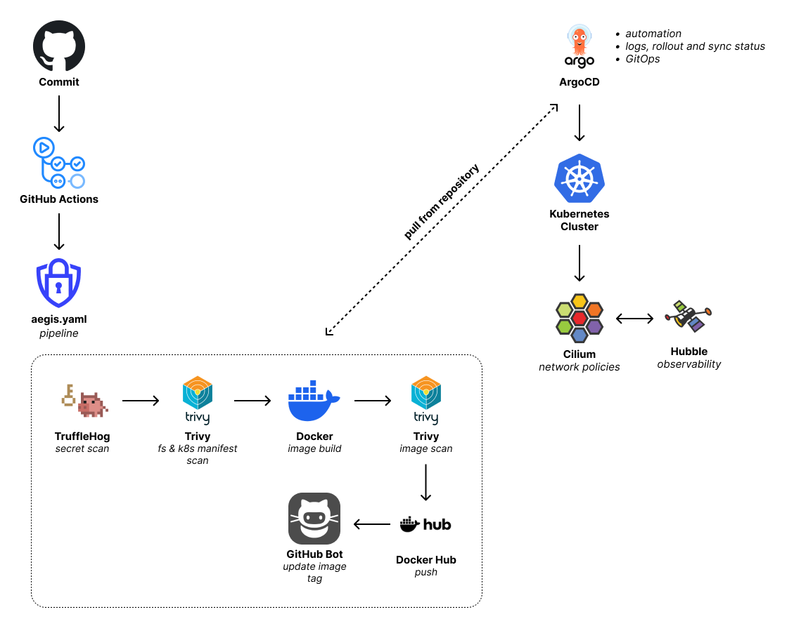

# 🛡️ Aegis Pipeline

<div align="center">
  
  <br>
  
</div>

This project is the result of a project work carried out in collaboration with [Fides Group](https://www.fidesgroup.com/it) and students from the **Cisco DTLab**.

This repository serves a **demonstrative and educational** purpose. It contains the implementation of a secure and automated **DevSecOps** pipeline for validating, containerizing, and deploying cloud-native workloads on Kubernetes clusters.

## 🔀 Flow
<div align="center">
  
</div>

## 🏗️ Architecture & Modules

The project covers the 3 required modules as follows:

### Module 1: DevOps and Orchestration with Kubernetes
- **Containerization**: The pipeline builds the image and pushes it to Docker Hub only if all security checks pass.
- **K8s Manifests**: The `k8s-examples/` folder contains examples of a Deployment (with Probes and Resource Limits), Service, ConfigMap, PVC, Secret, RBAC/ServiceAccount configurations, and OPA Gatekeeper policies used to manage cluster privileges and enforce security compliance.
- **GitOps CD**: Delegated to _Argo CD_ to visualize state, manage synchronizations, detect configuration drift, and easily handle rollbacks.

### Module 2: Cloud-Native Networking and Security with Cilium
- **Default Deny & Microsegmentation**: Implementation of `CiliumNetworkPolicy` rules (versioned in the repository) starting with a *Default Deny* approach for the namespace.
- **L7 Traffic Control**: Authorization of strictly necessary traffic via Labels (e.g., blocking direct database access from the frontend, authorizing specific API calls) restricted to allowed HTTP paths.

### Module 3: DevSecOps and Observability
- **Secure Pipeline**:
  - **Trufflehog**: Secret scanning to prevent accidental commits of plaintext credentials.
  - **Trivy**: Filesystem and dependency scanning, container image vulnerability scanning (OS and libraries), and formal security validation on Kubernetes YAML manifests.
- **In-Cluster Security (OPA Gatekeeper)**: Declarative rules in `k8s-examples/opa-policies` (ConstraintTemplates and Constraints) to validate resources during admission, preventing insecure instantiations such as privileged containers.
- **Observability**: Configured in-cluster utilizing Cilium and Hubble for deep network flow mapping, connectivity visualization, and packet drop analysis.

## 🛠️ Technology Stack
- **CI Pipeline**: GitHub Actions
- **Containerization**: Docker
- **Security Scanning**: Trivy, TruffleHog
- **Orchestration**: Kubernetes
- **GitOps CD**: Argo CD
- **Networking & CNI**: Cilium, Hubble
- **Policy Engine**: OPA Gatekeeper

## 📁 Repository Structure

```text
.
├── .github/
│   └── workflows/
│       └── aegis.yaml           # DevSecOps CI/CD Pipeline
├── k8s-examples/
│   ├── deployment.yaml          # Secure workload example
│   ├── service.yaml             # Service exposure
│   ├── configmap.yaml / pvc.yaml / secret.yaml # Data & persistence management
│   ├── rbac.yaml / serviceaccount.yaml         # In-cluster permissions
│   ├── network-policies.yaml    # Cilium Policies
│   └── opa-policies/            # OPA Gatekeeper Policies
└── README.md
```

## 💻 Implementation

### Cluster Setup
You will need a functioning Kubernetes cluster to proceed.
- Install ArgoCD ([instructions](https://argo-cd.readthedocs.io/en/stable/getting_started/#1-install-argo-cd))
- Install OPA Gatekeeper ([instructions](https://open-policy-agent.github.io/gatekeeper/website/docs/install/#deploying-a-release-using-prebuilt-image))
- Install Cilium ([instructions](https://docs.cilium.io/en/stable/gettingstarted/k8s-install-default/))
- Instal Hubble ([instructions](https://docs.cilium.io/en/stable/observability/hubble/setup/))

### Repository Setup
On your GitHub repository, you will have to:
- Implement the `aegis.yaml` workflow by copying the file in your `.github/workflows` folder
- Insert your *Docker Hub* credentials in your *GitHub Secrets*

### GitOps Setup
Port-forward the ArgoCD GUI
```bash
kubectl port-forward svc/argocd-server -n argocd 8080:443
```
\
Get the default password for the "*admin*" user
```bash
kubectl -n argocd get secret argocd-initial-admin-secret -o jsonpath="{.data.password}" | base64 -d; echo
```
\
Browse to your `https://localhost:8080`, login with the default credentials and create your application in ArgoCD

### Hubble Observability
Port-forward the Hubble GUI
```bash
kubectl port-forward -n kube-system svc/hubble-ui 12000:80
````
And open your browser to `http://localhost:12000` to access the Hubble interface.

## 🔗 Demonstration
This repository focuses on demonstrating the infrastructure and security configurations. The fully functional CI/CD pipeline, including the active **Argo CD** deployment, is implemented in a separate repository hosting a custom-built **3-tier mock application** (Frontend, Backend, Database) used as our live workload.

👉 [**View the Live Implementation Repository here**](https://github.com/gcrbr/aegis-mock-app)